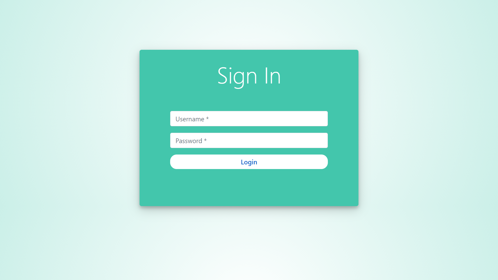

# Distribuidora CRM
es un sistema de gestión de relaciones con el cliente (CRM) desarrollado en Django que presenta un panel de control con un esquema de colores verde azulado.

Características principales:

    Gestión de Productos: Permite crear, actualizar o eliminar información relacionada con productos.

    Gestión de Órdenes: Facilita la creación, actualización o eliminación de órdenes de compra o ventas.

    Gestión de Contactos: Permite administrar y mantener la información de contactos, como clientes, proveedores o cualquier otra entidad relevante.

    Búsqueda y Filtros: Proporciona capacidades de búsqueda y filtrado para encontrar rápidamente información específica de productos, órdenes o contactos.

    Tareas Pendientes (ToDo): Permite crear tareas para recordatorios, lo que puede ser especialmente útil para una distribuidora. Estas tareas podrían incluir recordatorios de seguimiento de pedidos, seguimiento de contactos o cualquier otra actividad relevante para la distribución.

### Screenshots

<table>
  <tr>
  <td align="center">
      <a href="https://raw.githubusercontent.com/masoodmomin/teal-crm/main/screenshots/login.png">
        
      </a>
      <br />
      <p>Login Page</p>
    </td>
    <td align="center">
      <a href="https://raw.githubusercontent.com/masoodmomin/teal-crm/main/screenshots/dashboard.png">
        
      </a>
      <br />
      <p>Dashboard</p>
    </td>
    <td align="center">
      <a href="https://raw.githubusercontent.com/masoodmomin/teal-crm/main/screenshots/contacts.png">
        
      </a>
      <br />
      <p>Contacts</p>
    </td>
    <td align="center">
      <a href="https://raw.githubusercontent.com/masoodmomin/teal-crm/main/screenshots/product.png">
        
      </a>
      <br />
      <p>Products</p>
    </td>
    <td align="center">
      <a href="https://raw.githubusercontent.com/masoodmomin/teal-crm/main/screenshots/tasks.png">
        
      </a>
      <br />
      <p>Tasks</p>
    </td>
    </tr>
</table>

### Clone this repository

```
git clone https://github.com/masoodmomin/teal-crm.git](https://github.com/marlow2526/CRM-distribuidora
```

### Dependencies
```
django-filter=2.4.0
```
### Run the following commands to get started:

```
pip install django django-filter
python manage.py makemigrations crm tasks
python manage.py migrate
python manage.py runserver
```
